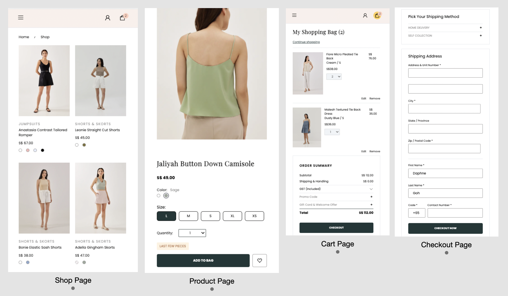

# eCommerce-Clone

This project aims to clone an existing e-commerce site (Love Bonito Singapore) to enhance my learning at GA Singapore. In this project, I have also attempted to make the website mobile-responsive.

## Technologies

1. React
2. React-router-dom (v6)
3. React-icons
4. Axios - For fetching of APIs
5. Tailwind - For styling

## Wireframe

## Look of the Site - Web

## Look of the Site - Mobile View

## User Stories

### Customers

1. Shop all products -
   In general, customers should be able to browse all products. In the main shopping page, all active products are shown with general product information (i.e. product description, category, price and available colors). Colors with zero onhand quantity will be marked with a slash across the color.

2. Product -
   In the product page, once a color option is selected, all available sizes associated with the color will be displayed.
   (a) Size buttons with zero onhand quantity are disabled.
   (b) A quantity alert message is displayed along with the option selected. - Quantity > 10 : In-stock - Quantity between 0 and 10 : Last few pieces - Quantity equals to or below 0: Out-of-stock
   (c) Quantity selection: Customer may only add up to 5 pieces to cart for each selection. Quantity selection is hidden if onhand quantity is equal to or below zero.

3. Adding to cart -
   (a) Customer adds to cart w/o login: product will be saved in local storage and transferred to database after customer login.
   (b) Customer adds to cart after login: product will be saved to database immediately.

4. View cart -
   Both cart and checkout page are being setup as protected routes, customers must login in order to access to those pages. Customers will be redirected to the login page if they try to access their cart from the navbar w/o login.

In the cart page, customers are able to perform the following actions -
(a) edit cart
(b) remove cart
(c) navigate to checkout page

Note: Customers are not allowed to proceed to checkout if any of the cart items is out-of-stock.

5. Checkout -
   Customer must fill in all required information before they are allowed to submit their order. A thank-you message with the order ID is displayed when order is received in the backend.
