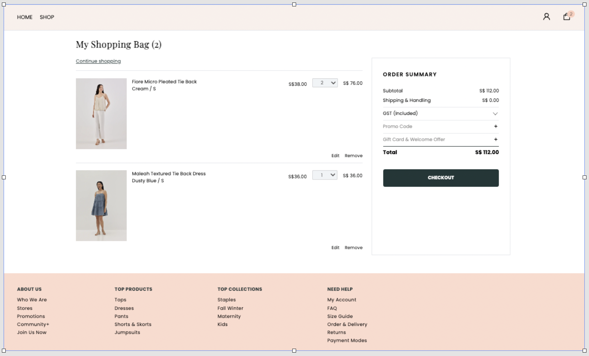
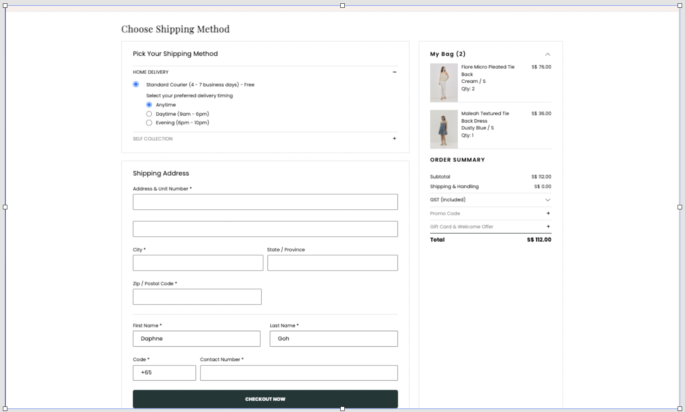

# eCommerce-Clone

This project aims to clone an existing e-commerce site (Love Bonito Singapore) to enhance my learning at GA Singapore.

## Technologies

1. React
2. React-router-dom (v6)
3. React-icons
4. Axios - For fetching of APIs
5. Tailwind - For styling

## Wireframe

## Look of the Site - Web

## Look of the Site - Mobile View

|
|
